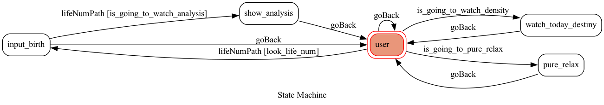

# ToCFinal

## 簡介
    現今社會有許多壓力環繞在我們身邊，我要設計一個 linebot 叫做「你的心靈導師」，用在壓力山大、徬徨無措時，可以有一個了解自己，進一步整理自己情緒重新出發的工具。

## 使用說明
共有三種選擇可以供使用者選擇
1. 計算生命靈數
2. 查看本日運勢
3. 觀看放鬆影片

## 使用示範
剛加入時，輸入任意對話可進入功能選單，若選擇計算生命靈數會進入 input_birth 狀態，會請你輸入你的生日，機器人會回答你你的生命靈數和你對應的人格。

輸入restart會帶你回到選單列表

選擇放鬆心情和本日運勢會分別回傳會讓你放鬆的影片列表和查看運勢的網站

## FSM

### state 說明
input_birth : 等待你輸入生日

show_analysis : 展示你的生命靈數，輸入restart可回到選單

watch_today_destiny: 查看今日運氣，輸入restart可回到選單

pure_relax : 觀看舒壓影片，輸入restart可回到選單